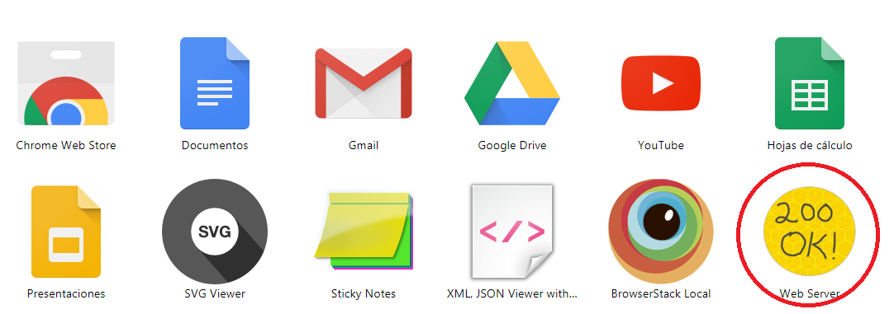
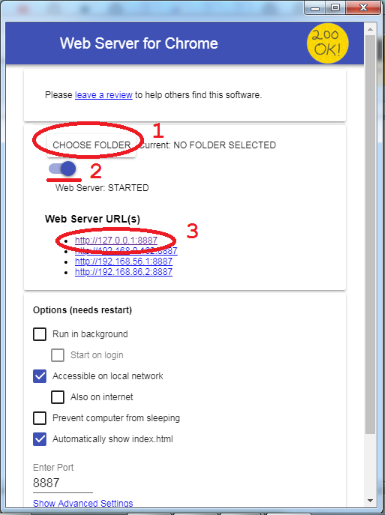

# Memory Game Project

This is the third project of the Front-End Web Developer Nanodegree. The task was to recreate the classic arcade game Frogger with provided visual assets and a game loop engine by adding a number of entities to the game including player characters, enemies and collectable items. The technologies used for the project are the following:
- Object Oriented JavaScript
- Css3
- Html5 & canvas

## Getting Started

1. Clone this repo or download it
`$ git clone https://github.com/cahergil/arcade-game.git `

2. Install [200 Ok Web Server for Chrome]( https://chrome.google.com/webstore/detail/web-server-for-chrome/ofhbbkphhbklhfoeikjpcbhemlocgigb?hl=en)

3. After installing this extension, type in the browser `chrome://apps` and it will list your installed app. 

4. Click on the extension to open the app. Select the folder of the proyect, start the server and go to the provided http directions:

## How to play

Use the arrow keys; up, right, down, left to move the hero. The player starts with 6 lives, each collision with a bug reduces the number of lives by one and the hero will be positioned at the start point. The capture of a gem gives the player 200 points. As the hero reaches the water, it gets 100 points, go to the initial position,new gems are layed out on the canvas, and the level increases by 1. New bugs are added to the game as the user passes levels, increasing thus the difficulty of the game.

## Attributions

Thanks to Udacity for providing engine.js and resource.js. The original source code can be found at [frontend-nanodegree-arcade-game](https://github.com/udacity/frontend-nanodegree-arcade-game)

## Resources

###### Web Font

- [Classic Arcade Style Font](http://www.dafont.com/arcade-classic-pizz.font) By Pizzadude

###### Sound Effects

- [Howler.js: Web Audio JavaScript Library](https://github.com/goldfire/howler.js)
- [Sound Bible: Sound effecs library](http://soundbible.com/free-sound-effects-1.html)

## License

MIT License

Copyright (c) 2018 Carlos Hernández Gil

Permission is hereby granted, free of charge, to any person obtaining a copy
of this software and associated documentation files (the "Software"), to deal
in the Software without restriction, including without limitation the rights
to use, copy, modify, merge, publish, distribute, sublicense, and/or sell
copies of the Software, and to permit persons to whom the Software is
furnished to do so, subject to the following conditions:

The above copyright notice and this permission notice shall be included in all
copies or substantial portions of the Software.

THE SOFTWARE IS PROVIDED "AS IS", WITHOUT WARRANTY OF ANY KIND, EXPRESS OR
IMPLIED, INCLUDING BUT NOT LIMITED TO THE WARRANTIES OF MERCHANTABILITY,
FITNESS FOR A PARTICULAR PURPOSE AND NONINFRINGEMENT. IN NO EVENT SHALL THE
AUTHORS OR COPYRIGHT HOLDERS BE LIABLE FOR ANY CLAIM, DAMAGES OR OTHER
LIABILITY, WHETHER IN AN ACTION OF CONTRACT, TORT OR OTHERWISE, ARISING FROM,
OUT OF OR IN CONNECTION WITH THE SOFTWARE OR THE USE OR OTHER DEALINGS IN THE
SOFTWARE.

### Front-End Web Developer Nanodegree
  

